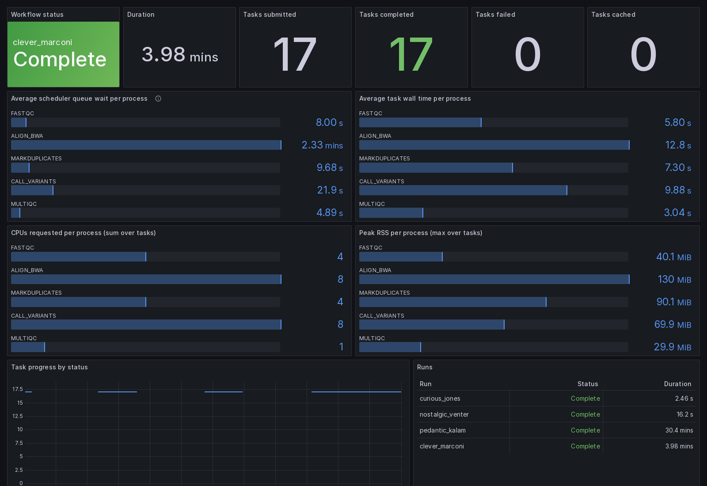

# nf-prometheus

Prometheus metrics for [Nextflow](https://nextflow.io) pipelines, designed for
**on-premise HPC clusters** (Slurm, shared filesystems, Apptainer, air-gapped
environments).

Unlike a classic HTTP exporter, nf-prometheus is built HPC-first: the head job
often runs on a compute node behind a firewall, unreachable by your Prometheus
server. The primary export mode therefore requires **no network connectivity at
all**.



*A demo run on the bundled Slurm test cluster. ALIGN_BWA's 2.3-minute
average queue wait is real: its 2-CPU tasks queue behind each other on the
4-CPU node — exactly the kind of contention this dashboard exists to show.*

## Need and solution

If you run Nextflow on a shared on-premise cluster, your observability
options in 2026 are narrower than they look: the hosted platform's free
tier is sized for individual use, self-hosting it is an enterprise license
conversation, the open-source nf-tower was archived in January 2025, and
`-with-weblog` hands you raw JSON events and an exercise for the reader.
Meanwhile the questions that actually cost you time stay unanswered while
the run is going: **how long are my tasks sitting in the queue, per
process? Which process requests 32 GB and peaks at 4? Is the run stuck or
just slow?**

Almost every HPC site already operates a Prometheus + Grafana stack for
node health. nf-prometheus is the missing bridge between Nextflow's head
job and that stack — built for the constraint that makes generic exporters
fail on HPC: the head job is itself a batch job, often on a compute node
your Prometheus server cannot reach, sometimes on a cluster with no
outbound network at all. Hence textfile-first export (a shared filesystem
is the one interface every node has), with Pushgateway and HTTP modes
where the network allows. Zero dependencies beyond the JDK, and metrics
can never fail your pipeline.

The longer story, with real incidents from the test cluster:
[*Where did my task go? Monitoring Nextflow on Slurm without Tower*](https://www.callistolabs.eu/blog/monitoring-nextflow-on-slurm-without-tower/).

## Export modes

| Mode | Status | How it works |
|---|---|---|
| **Textfile collector** | ✅ available | Writes a `.prom` file (atomic rename) for the [node_exporter textfile collector](https://github.com/prometheus/node_exporter#textfile-collector) — typically on a shared filesystem. Works air-gapped. |
| **Pushgateway** | ✅ available | PUT to your [Prometheus Pushgateway](https://github.com/prometheus/pushgateway) on the group `job/<pushJob>/run_name/<run>`: live updates during the run (throttled to 5s), atomic replace per run, batch-job lifecycle handled by the gateway. Scrape it with `honor_labels: true`. |
| **HTTP `/metrics`** | ✅ available | Classic scrape endpoint served by the head job for the duration of the run (`httpPort`). For head jobs on nodes reachable by your Prometheus server. |

## Metrics (v0.1)

- `nf_workflow_info{run_name,session_id}` — run information
- `nf_workflow_status{run_name}` — 0=running, 1=complete, 2=error
- `nf_workflow_duration_seconds{run_name}`
- `nf_tasks_total{run_name,process,status}` — submitted / completed / failed / cached
- `nf_task_queue_seconds_total{run_name,process}` — time spent waiting in the scheduler queue
- `nf_task_realtime_seconds_total{run_name,process}`
- `nf_task_cpus_requested_total{run_name,process}`
- `nf_task_peak_rss_bytes_max{run_name,process}`

## Usage

New to this? Follow the [5-minute setup guide](docs/5-minute-setup.md) —
from zero to a Grafana dashboard, including the Pushgateway and HTTP
variants and the HPC-specific notes.

```groovy
// nextflow.config
plugins {
    id 'nf-prometheus'
}

prometheus {
    // where to write the metrics file (relative to the launch directory)
    path = '/shared/metrics/my-pipeline.prom'

    // optional: also push to a Prometheus Pushgateway (live updates)
    pushgateway = 'http://pushgateway.example.org:9091'
    pushJob = 'nextflow'   // grouping-key job name (default)

    // optional: serve /metrics over HTTP for the duration of the run
    httpPort = 9200
}
```

Then point your node_exporter at the directory:

```
node_exporter --collector.textfile.directory=/shared/metrics
```

## Grafana dashboard

A ready-to-import dashboard ships with the plugin:
[`grafana/nf-prometheus-dashboard.json`](grafana/nf-prometheus-dashboard.json).

- Run status, duration and task counters at a glance
- Per-process **scheduler queue wait** (the number your login-node `squeue`
  never aggregates for you), wall time, CPUs requested and peak RSS
- Task progress over time and a table of recent runs
- A `run` variable to switch between runs

Import it via *Dashboards → New → Import* (or provision it from a file),
with a Prometheus datasource that scrapes your node_exporter or
Pushgateway. When scraping a Pushgateway, set `honor_labels: true` so the
`run_name` label is preserved.

To see it working locally without a cluster, the repo includes a full dev
stack (single-node Slurm + node-exporter + Pushgateway + Prometheus +
provisioned Grafana):

```bash
make assemble
cd dev/slurm && docker compose up -d --build
docker compose exec slurm nextflow run main.nf -c ../dev/slurm/slurm-test.config
# then open http://localhost:3000/d/nf-prometheus
```

## Development

```bash
make assemble   # build the plugin
make test       # unit tests
make install    # install into the local Nextflow plugins dir
```

End-to-end check:

```bash
make install
cd validation && nextflow run main.nf && cat nf-prometheus.prom
```

## License

[Apache 2.0](COPYING)
